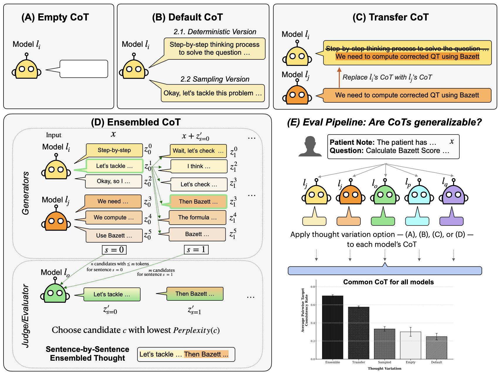

<h1 align="center"> 🤖🤝🤖 HACHI 🤖🤝🤖 </h1>
<p align="center"> <b>Do explanations generalize across large reasoning models?</b>  (<a href="https://arxiv.org/abs/2601.11517">Pal, Bau, & Singh, arXiv 2026</a>). 
</p>

<p align="center">
  
  
</p>  




# Code overview

Note that this repository is still being cleaned up. The contents presently consist of raw dumps from two separate forked repositories that were used during our research. If you want to use this immediately (whether the data or the RL trained models or other additional questions), contact Koyena at pal.k@northeastern.edu.

The repository is organized into two main directories corresponding to the datasets we worked with:

- Medcalc-Bench
    - Originally forked from: https://github.com/ncbi-nlp/MedCalc-Bench
    - All newly developed code related to this dataset is located in the evaluation/ folder.
- Instruction-Induction
    - Originally forked from: https://github.com/orhonovich/instruction-induction
    - Additional scripts and related code have been added directly within this directory.

# Reference

If you use this repository in your research, please cite:

```bibtex
@article{pal2026explanations,
  title={Do explanations generalize across large reasoning models?},
  author={Pal, Koyena and Bau, David and Singh, Chandan},
  journal={arXiv preprint arXiv:2601.11517},
  year={2026}
}
```